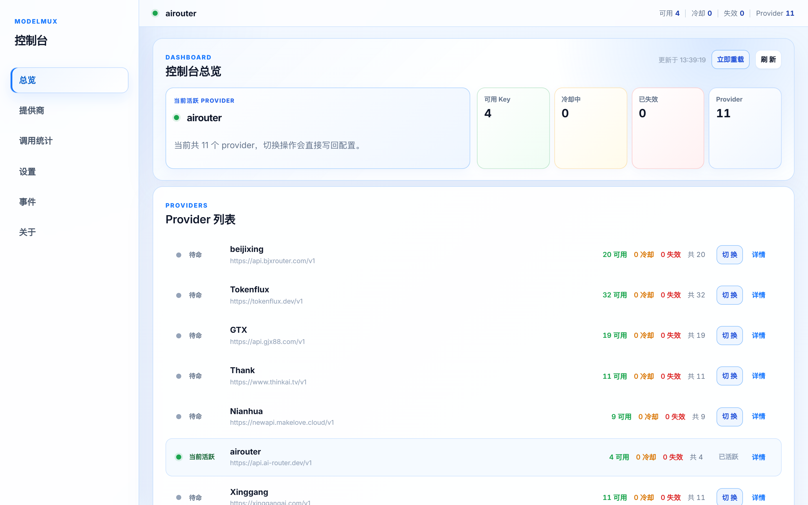

<p align="center">
  <h1 align="center">⚡ ModelMux</h1>
  <p align="center">
    <strong>本地模型 API 反向代理 — 多 Provider · 多 Key · 单入口</strong>
  </p>
  <p align="center">
    将多家模型服务的多组 API Key 收归一个本地代理入口，智能轮换、自动重试、一键切换。
  </p>
  <p align="center">
    
    
    
    
  </p>
</p>

<p align="center">
  <a href="#快速开始">🚀 快速开始</a> · <a href="#架构概览">🏗️ 架构</a> · <a href="#配置参考">⚙️ 配置</a> · <a href="#admin-api">📡 API</a> · <a href="#开发">🛠️ 开发</a>
</p>

---



## ✦ 特性

| | |
|---|---|
| 🔀 **多 Provider 统一管理** | 多家模型服务、多组上游地址、多把 API Key 收归一个本地入口 |
| 🔄 **Key 级状态机** | `active → cooling → invalid` 三态流转，互不干扰 |
| ⚡ **智能重试** | 429 冷却、401 失效、网络抖动分级处理，独立重试预算 |
| ♨️ **配置热重载** | `fsnotify` 监听 + 原子写盘，改配置即时生效、reload 失败自动回滚 |
| 🌊 **流式透传** | SSE / Streaming 按 chunk 立即 flush，零缓冲延迟 |
| 🖥️ **内置管理台** | React SPA 嵌入 Go 二进制，Dashboard / Provider / 统计 / 事件一屏掌控 |
| 🔒 **安全设计** | Key SHA-256 哈希持久化、密钥脱敏、Admin 默认仅本地监听 |
| 📦 **单二进制交付** | 前端 `go:embed` 打进可执行文件，零依赖部署 |

## 🚀 快速开始

### ① 准备配置

```powershell
Copy-Item config.example.json config.json
```

编辑 `config.json`，填入你的 Provider 和 Key：

```json
{
  "active_provider": "primary",
  "providers": [
    {
      "id": "primary",
      "target_url": "https://your-provider.com",
      "keys": ["sk-key-1", "sk-key-2"]
    },
    {
      "id": "backup",
      "target_url": "https://backup-provider.com",
      "keys": ["sk-backup-key"]
    }
  ]
}
```

### ② 启动

```powershell
.\start.ps1
```

脚本会自动检测环境、构建二进制（如缺失）、后台启动并打开管理台。

手动构建：

```powershell
go build -trimpath -ldflags="-s -w" -o modelmux.exe .
.\modelmux.exe -config config.json
```

### ③ 接入客户端

| 配置项 | 值 |
|---|---|
| **Base URL** | `http://127.0.0.1:18080/v1` |
| **API Key** | 任意非空值（转发时会被替换为真实 Key） |

默认监听地址：

```
🔌 代理入口   http://127.0.0.1:18080
🛠️ 管理 API   http://127.0.0.1:18081
🖥️ 管理台     http://127.0.0.1:18081/console/
```

## 🏗️ 架构概览

```
┌─────────────┐
│   Client    │  任意 OpenAI 兼容客户端
└──────┬──────┘
       │  http://127.0.0.1:18080/v1
       ▼
┌──────────────────────────────────────────┐
│              ModelMux Proxy              │
│                                          │
│  ┌──────────┐  ┌──────────┐             │
│  │ Provider │  │ Provider │  ...         │
│  │   A      │  │   B      │             │
│  │ ┌──┐┌──┐│  │ ┌──┐     │             │
│  │ │K1││K2││  │ │K3│     │             │
│  │ └──┘└──┘│  │ └──┘     │             │
│  └──────────┘  └──────────┘             │
│                                          │
│  Key 状态机 · 重试策略 · 请求头改写     │
└──────────────────────────────────────────┘
       │
       ▼
   上游 Provider API
```

## 🔄 Key 状态机

```
          429 / Retry-After
  active ──────────────────► cooling
    │                          │
    │ 401 / 余额不足          │ 冷却到期
    ▼                          ▼
 invalid                     active
```

| 事件 | 状态变化 | 重试预算 |
|---|---|---|
| `429` 速率限制 | → `cooling` | `max_retries` |
| `401` / 余额不足 `403` | → `invalid` | `max_retries` |
| 网络抖动 / 连接重置 | 临时 `cooling` | `max_transient_retries` |
| 上游 `502/503/504` | 不改变 Key 状态 | `max_transient_retries` |

> **Note:** `invalid` Key 不会自动恢复，需通过管理台重置、API 调用，或等下次启动超过 `invalid_ttl_hours` 后自动恢复。

## ⚙️ 配置参考

### Provider 配置

```json
{
  "active_provider": "primary",
  "providers": [
    {
      "id": "primary",
      "target_url": "https://provider-a.com",
      "keys": ["sk-a1", "sk-a2"]
    },
    {
      "id": "backup",
      "target_url": "https://provider-b.com",
      "keys": ["sk-b1"]
    }
  ]
}
```

> 💡 兼容旧版单 Provider 格式——无 `providers` 字段时，顶层 `target_url` + `keys` 会被视为 `default` Provider。

### 运行参数

| 字段 | 默认值 | 说明 |
|---|---|---|
| `listen` | `127.0.0.1:18080` | 代理服务监听地址 |
| `admin_listen` | `127.0.0.1:18081` | 管理服务监听地址 |
| `active_provider` | 首个 Provider | 当前使用的 Provider ID |
| `cooling_seconds` | `60` | 429 未返回 Retry-After 时的冷却时长 |
| `max_retries` | `3` | Key 级错误换 Key 重试预算 |
| `max_transient_retries` | `1` | 网络/Provider 临时故障重试预算 |
| `request_timeout_seconds` | `120` | 上游请求总超时 |
| `connect_timeout_seconds` | `5` | TCP 建连 + TLS 握手超时 |
| `response_header_timeout_seconds` | `30` | 等待上游响应头超时 |
| `transient_cooling_seconds` | `15` | 连接级临时故障短冷却 |
| `wait_for_key_timeout_ms` | `1000` | 所有 Key 仅 cooling 时最大等待时长 |
| `max_body_bytes` | `33554432` | 请求体上限（默认 32 MiB） |

### 📋 日志 & 持久化

| 字段 | 默认值 | 说明 |
|---|---|---|
| `log_level` | `info` | `debug` / `info` / `warn` / `error` |
| `log_format` | `text` | `text` / `json` |
| `log_output` | `stdout` | `stdout` / `file` / `both` |
| `log_file` | — | 文件日志路径 |
| `log_max_size_mb` | `20` | 单日志文件最大 MB |
| `log_max_backups` | `5` | 保留旧日志数量 |
| `log_max_age_days` | `30` | 保留旧日志天数 |
| `log_compress` | `false` | 是否压缩旧日志 |
| `persist_state` | `true` | 持久化 Key 状态 |
| `state_file` | `state.json` | Key 状态文件路径 |
| `invalid_ttl_hours` | `24` | invalid Key 自动恢复保留时长 |

### 📊 调用统计

| 字段 | 默认值 | 说明 |
|---|---|---|
| `stats_enabled` | `true` | 启用调用明细持久化 |
| `stats_dir` | `stats_data` | 统计文件目录 |
| `stats_retention_days` | `30` | 统计文件保留天数 |
| `stats_max_recent_records` | `10000` | 内存中最近记录上限 |

## ♨️ 热重载

保存 `config.json` 后自动 reload（`fsnotify`），也可手动触发：

```powershell
Invoke-RestMethod -Method Post http://127.0.0.1:18081/admin/reload
```

- ✅ **热生效**：`active_provider` · `providers` · `cooling_seconds` · `max_retries` · 超时类参数 · `max_body_bytes`
- 🔁 **需重启**：`listen` · `admin_listen` · 日志类 · 持久化类 · 统计类

## 📡 Admin API

所有管理接口均挂在 `admin_listen` 地址下。

### 🔧 运维

| Method | Path | 说明 |
|---|---|---|
| `GET` | `/admin/health` | 当前 Provider 可用性 |
| `GET` | `/admin/status` | Provider 与 Key 池状态 |
| `POST` | `/admin/reload` | 手动重读配置 |

### 🔀 Provider 管理

| Method | Path | 说明 |
|---|---|---|
| `GET` | `/admin/api/v1/providers` | Provider 列表 |
| `POST` | `/admin/api/v1/providers` | 新增 Provider |
| `GET` | `/admin/api/v1/providers/{id}` | Provider 详情 |
| `PUT` | `/admin/api/v1/providers/{id}` | 修改上游地址 |
| `DELETE` | `/admin/api/v1/providers/{id}` | 删除 Provider |
| `POST` | `/admin/api/v1/providers/{id}/activate` | 切换为活跃 |

### 🔑 Key 管理

| Method | Path | 说明 |
|---|---|---|
| `POST` | `/admin/api/v1/providers/{id}/keys:append` | 追加 Keys |
| `POST` | `/admin/api/v1/providers/{id}/keys:replace` | 替换 Keys |
| `POST` | `/admin/api/v1/providers/{id}/keys:delete` | 删除 Keys |
| `POST` | `/admin/api/v1/providers/{id}/keys/{key_id}/reset` | 重置单个 Key |

### 🖥️ 控制台 & 其他

| Method | Path | 说明 |
|---|---|---|
| `GET` | `/admin/api/v1/dashboard` | 控制台首页数据 |
| `GET` | `/admin/api/v1/settings` | 当前配置与热重载边界 |
| `PUT` | `/admin/api/v1/settings` | 保存设置 |
| `GET` | `/admin/api/v1/events` | 最近运行事件 |
| `GET` | `/admin/api/v1/about` | 运行环境与版本 |
| `POST` | `/admin/api/v1/config/backup` | 导出配置 |
| `POST` | `/admin/api/v1/state/backup` | 导出 Key 状态 |

## 📂 项目结构

```
ModelMux/
├── admin/     管理 API · 事件缓冲区 · 嵌入式控制台
├── config/    JSON 配置读取 · 校验 · 热重载 · 原子写盘
├── logx/      slog 字段 · 事件分类 · 密钥脱敏
├── pool/      Provider 池 · Key 池状态机
├── proxy/     反向代理 · 认证头改写 · 重试分类 · 流式透传
├── state/     Key 状态持久化（SHA-256 哈希）
├── web/       React + Vite 管理台（go:embed 嵌入）
├── main.go    入口 · 信号处理 · 优雅关闭
└── config.example.json
```

## 🛠️ 开发

```powershell
# 后端测试 & 检查
go test ./...
go vet ./...

# 前端构建
cd web && npm ci && npm run build && cd ..

# 前端开发模式（自动代理 /admin → 127.0.0.1:18081）
cd web && npm run dev

# Make 快捷命令
make build       # 当前平台编译
make test        # 运行测试
make run         # 构建并启动
```

> **Tip:** 改了 `web/` 目录后需重新 `npm run build`，产物会被 `go:embed` 打进二进制。

## 🔍 排障

**请求返回 503：**
- 当前 Provider 无可用 Key（全部 cooling / invalid）
- 所有 Key 在 cooling 且 `wait_for_key_timeout_ms` 内无恢复
- 上游地址 / DNS / TLS / 网络不可达
- 配置变更后尚未成功 reload

**配置修改未生效：**
- 确认 `-config` 指向正确的文件
- 调用 `POST /admin/reload` 检查错误
- `listen` / `admin_listen` / 日志 / 持久化字段需重启

```powershell
# 快速诊断
Invoke-RestMethod http://127.0.0.1:18081/admin/health
Invoke-RestMethod http://127.0.0.1:18081/admin/status
```

## 🛡️ 安全

- ⚠️ `admin_listen` 默认 `127.0.0.1:18081`，**不要暴露到公网**
- 🚫 不要提交 `config.json`、`state.json`、日志文件到版本控制
- 🔐 不要在日志、截图、Issue、PR 中暴露完整 API Key
- 🌐 远程访问管理台请额外加网络隔离或反向代理鉴权

---

<p align="center">
  <sub>Built with ❤️ using Go + React + Vite</sub>
</p>

## License

MIT
