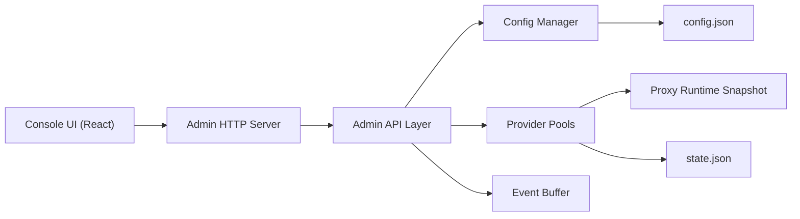

# ModelMux Frontend Admin Console Implementation Plan

> **For Claude:** REQUIRED SUB-SKILL: Use superpowers:executing-plans to implement this plan task-by-task.

**Goal:** 为 ModelMux 增加一个面向个人使用的前端可视化管理界面，让用户可以在本地通过浏览器完成 provider 管理、active provider 切换、key 状态查看、配置编辑和运行事件排查，同时保持项目“单二进制、单配置文件、低运维成本”的核心定位。

**Architecture:** 管理台采用 `React + TypeScript + Vite` 构建为静态资源，由 Go 管理服务通过 `embed` 嵌入并提供页面访问。后端继续使用现有单体结构，在 `admin`、`config`、`pool`、`proxy`、`state` 基础上补充面向前端的管理 API、配置写入能力和事件缓冲区；配置文件 `config.json` 仍然是唯一真相源，运行时状态继续由内存中的 provider pools 和 state persistence 负责。

**Tech Stack:** Go 标准库 HTTP、`embed`、React、TypeScript、Vite、Ant Design、TanStack Query、Apache ECharts、Vitest、Testing Library。

---

## 1. 背景与目标

ModelMux 当前已经具备稳定的后端能力：

- 多 provider 配置与 `active_provider` 切换
- provider 内部 key 轮询与状态机
- 配置热重载
- key 状态持久化
- 基础管理接口 `/admin/status`、`/admin/health`、`/admin/reload`

当前短板不在核心代理能力，而在“可操作性”：

- 配置依赖手工编辑 `config.json`
- provider 与 key 管理缺少可视化入口
- 热生效字段与重启生效字段没有直观区分
- key 状态排查只能看 JSON 或日志
- 对个人用户来说，常见操作成本偏高

本方案的目标不是把 ModelMux 做成一个复杂的平台，而是在不破坏现有后端设计的前提下，为个人本地使用场景补齐“管理台”这一层能力。

## 2. 设计原则

### 2.1 核心原则

- 单机优先：默认仅服务本地使用，不引入多用户体系。
- 单二进制优先：最终交付物仍然以 Go 单二进制为主。
- 配置文件优先：`config.json` 继续作为唯一配置源，不引入数据库。
- 低运维优先：避免引入需要额外安装或常驻的外部依赖。
- 安全最小化：不在前端回显完整 key，不扩大敏感信息暴露面。
- 渐进增强：先做最有价值的运维操作，再补事件流、导出、状态重置等增强功能。

### 2.2 非目标

以下内容不属于第一版目标：

- 多用户登录与权限系统
- 云端同步和远程托管
- 数据库持久化配置
- 手机端专用界面
- 完整时序监控系统
- provider 自动故障切换编排

## 3. 功能范围

### 3.1 MVP 功能

#### FR-01 仪表盘总览

展示当前系统关键状态：

- 当前 `active_provider`
- provider 总数
- 当前 provider 的 `active/cooling/invalid` key 数量
- 当前 provider 的请求数、错误数、平均延迟
- 最近事件摘要
- 常用快捷操作入口

#### FR-02 Provider 管理

支持通过 UI 管理 provider：

- 新增 provider
- 编辑 provider 基本信息
- 删除 provider
- 切换 active provider
- 查看每个 provider 的 key 状态汇总

provider 基本信息至少包括：

- `id`
- `target_url`
- `keys`

#### FR-03 Key 管理

支持按 provider 维度查看和维护 keys：

- 查看 key 列表
- 显示 key 的脱敏标识
- 查看 key 状态、请求数、错误数、平均延迟
- 查看 cooling 截止时间
- 查看最近一次 401 时间
- 追加 key
- 删除 key
- 全量替换 keys
- 手动重置单个 key 状态

#### FR-04 配置管理

支持通过 UI 修改全局配置参数：

- `cooling_seconds`
- `max_retries`
- `request_timeout_seconds`
- `max_body_bytes`
- `persist_state`
- `state_file`
- `invalid_ttl_hours`
- `listen`
- `admin_listen`
- `log_level`
- `log_format`
- `log_output`
- `log_file`
- 日志轮转配置

系统必须明确区分：

- 热生效字段
- 保存后需要重启才生效的字段

#### FR-05 运行事件查看

支持查看最近运行事件：

- reload 成功或失败
- active provider 切换
- 401 导致 key invalid
- 429 导致 key cooling
- 配额不足类 403 导致 key invalid
- 配置保存

#### FR-06 安全与确认机制

对危险操作加入显式确认：

- 删除 provider
- 全量替换 keys
- 删除 active provider 前必须先切换
- 修改重启生效字段后明确提醒

### 3.2 增强功能

以下功能建议在 MVP 稳定后进入增强阶段：

- provider 连通性测试
- 导出当前配置备份
- 导出状态文件备份
- 配置变更 diff 预览
- 原始 JSON 只读预览
- 主题切换

## 4. 非功能需求

### 4.1 部署与运行

- 管理台必须支持被嵌入 Go 二进制运行。
- 管理台页面应通过现有 admin server 提供访问。
- 默认场景下不要求额外安装 Node 运行时。

### 4.2 性能

- 仪表盘和 provider 列表应在本地环境快速打开。
- UI 数据刷新优先使用轮询，不引入 WebSocket 复杂度。
- 状态刷新周期建议为 2 到 5 秒。

### 4.3 安全

- 不在前端返回完整已有 key。
- 返回 key 标识时使用 `masked_key` 或 `key_id`。
- 写操作接口应增加基本来源校验。
- 默认仍建议 admin 服务仅监听 `127.0.0.1`。

### 4.4 稳定性

- 配置写入必须采用临时文件加原子替换策略。
- 配置写入失败时不得破坏原配置。
- reload 失败时必须保留旧运行时快照。

### 4.5 可维护性

- 前后端边界清晰，前端只关心 API，不直接拼接配置文件格式。
- 保持现有后端目录结构，尽量以新增文件和新增接口方式扩展。
- 后续能继续以 `go test ./...`、`go vet ./...`、`go test -race ./...` 校验稳定性。

## 5. 页面信息架构

### 5.1 页面结构

- `/console/dashboard`
- `/console/providers`
- `/console/providers/:id`
- `/console/settings`
- `/console/events`
- `/console/about`

### 5.2 页面职责

#### Dashboard

- 全局状态总览
- 当前 active provider 快速切换
- 最近事件摘要
- reload 和备份等快捷操作

#### Providers

- provider 列表
- 新增 provider
- 编辑 provider
- 删除 provider
- 设为 active provider

#### Provider Detail

- 查看 provider 基本信息
- 查看 key 状态表格
- 追加、删除、替换 keys
- 手动重置 key 状态

#### Settings

- 按分类编辑全局配置
- 高亮显示热生效与重启生效字段
- 展示保存后的生效说明

#### Events

- 查看最近系统事件
- 按事件类型过滤

#### About

- 显示版本信息
- 显示配置文件路径与状态文件路径
- 显示热重载说明和运行模式

## 6. 用户体验要求

### 6.1 交互原则

- 常见操作不超过 3 次点击可达。
- 危险操作必须二次确认。
- 保存配置后必须明确提示“已热重载”或“需重启生效”。
- 列表页支持空状态提示，而不是只显示空表格。

### 6.2 表单设计

- provider 编辑使用抽屉或独立详情页，不建议使用过深弹窗流程。
- keys 输入建议支持多行粘贴，一行一个 key。
- 对 `target_url` 做即时格式校验。
- 对 provider `id` 做唯一性校验。

### 6.3 状态呈现

- `active` 使用成功态标识
- `cooling` 使用警告态标识
- `invalid` 使用错误态标识
- cooldown 时间应提供相对时间和绝对时间

## 7. 技术方案

### 7.1 后端总体方案

后端不拆服务，继续使用单体结构扩展：

- `main.go` 保持双 HTTP server 模式不变
- `admin/` 继续承载管理接口
- `config/` 新增配置写入管理能力
- `pool/` 继续承载 provider/key 运行状态
- `proxy/` 在关键事件处上报运行事件
- `state/` 继续负责状态持久化

新增能力建议如下：

- `ConfigManager`：统一配置读取、校验、原子写入、reload、diff 分析
- `EventBuffer`：内存 ring buffer，保存最近事件
- `Admin API`：供前端使用的新 JSON 接口
- `Embedded Web UI`：静态文件嵌入与分发

### 7.2 前端总体方案

前端采用 SPA 方案：

- React：组件模型成熟，生态完整
- TypeScript：约束 API 类型，降低维护成本
- Vite：开发体验和构建速度适合中小型后台
- Ant Design：适合表格、表单、后台视图
- TanStack Query：管理轮询、缓存、失效刷新
- ECharts：绘制 key 状态分布和趋势图

### 7.3 部署模式

#### 开发模式

- 启动 Go admin server
- 启动 Vite dev server
- 前端通过代理访问本地 `/admin/api/*`

#### 生产模式

- `web/dist` 构建产物嵌入 Go
- Go admin server 提供 `/console/*`
- 同一进程同时提供页面和管理 API

## 8. 高层架构图

## 9. 数据与状态模型

### 9.1 真相源划分

- 配置真相源：`config.json`
- 运行时状态真相源：`pool.ProviderPools`
- 持久化运行状态：`state.json`

### 9.2 前端展示模型

建议在后端显式构建面向 UI 的 ViewModel，而不是让前端直接消费内部结构：

- `DashboardView`
- `ProviderListItemView`
- `ProviderDetailView`
- `KeyView`
- `SettingsView`
- `EventView`

### 9.3 Key 显示规则

对已存在 key，后端仅返回：

- `key_id`
- `masked_key`
- `state`
- `req_count`
- `err_count`
- `avg_latency_ms`
- `cool_until`
- `last_401_at`

后端不返回完整历史 key 明文。

## 10. API 设计范围

保留现有兼容接口：

- `GET /admin/status`
- `GET /admin/health`
- `POST /admin/reload`

新增前端专用接口：

### 10.1 Dashboard

- `GET /admin/api/v1/dashboard`

### 10.2 Providers

- `GET /admin/api/v1/providers`
- `GET /admin/api/v1/providers/{id}`
- `POST /admin/api/v1/providers`
- `PUT /admin/api/v1/providers/{id}`
- `DELETE /admin/api/v1/providers/{id}`
- `POST /admin/api/v1/providers/{id}/activate`

### 10.3 Keys

- `POST /admin/api/v1/providers/{id}/keys:append`
- `POST /admin/api/v1/providers/{id}/keys:replace`
- `POST /admin/api/v1/providers/{id}/keys:delete`
- `POST /admin/api/v1/providers/{id}/keys/{keyId}/reset`

### 10.4 Settings

- `GET /admin/api/v1/settings`
- `PUT /admin/api/v1/settings`

### 10.5 Events

- `GET /admin/api/v1/events`

### 10.6 Operations

- `POST /admin/api/v1/reload`
- `POST /admin/api/v1/config/backup`
- `POST /admin/api/v1/state/backup`

## 11. 关键设计决策

### ADR-01：采用嵌入式 SPA，而不是独立前端部署

**Decision**

采用独立开发、嵌入交付的 SPA 方案。

**Why**

- 保持单二进制交付体验
- 前端开发效率高
- 不增加生产部署复杂度

**Trade-offs**

- 构建链路会引入 Node 开发依赖
- 后端需要增加静态资源嵌入逻辑

### ADR-02：继续使用 `config.json`，不引入数据库

**Decision**

配置仍通过 JSON 文件存储和热重载。

**Why**

- 个人使用场景简单直接
- 与现有实现完全一致
- 降低迁移和运维成本

**Trade-offs**

- 配置编辑需要更谨慎的原子写入
- 并发写配置场景需要额外保护

### ADR-03：状态刷新采用轮询，而不是 WebSocket

**Decision**

第一版使用 TanStack Query 轮询获取状态。

**Why**

- 更简单稳定
- 本地后台状态规模小
- 易于测试和排错

**Trade-offs**

- 相比推送有轻微的展示延迟
- 会产生固定频率请求

### ADR-04：不回显完整已有 key

**Decision**

前端不读取和展示已存在 key 明文。

**Why**

- 减少敏感数据在 UI 和浏览器中的暴露面
- 更符合本地管理台的最小暴露原则

**Trade-offs**

- 编辑 existing keys 需要采用 append、delete、replace 三种模式
- 用户无法在 UI 中直接复制历史完整 key

## 12. 风险与应对

### 风险 1：配置写入与 watcher 自动 reload 重复触发

**影响**

- 可能造成重复 reload 日志或重复提示

**应对**

- 为 UI 保存链路增加 reload 去重标记
- 或在短时间窗口内合并 reload 事件

### 风险 2：新增写接口后安全面扩大

**影响**

- 若 admin 暴露到公网或跨域环境，会带来配置被篡改风险

**应对**

- 默认绑定本地地址
- 写接口校验 `Origin` 或 `Referer`
- 后续预留轻量 token 机制

### 风险 3：前端过度依赖内部结构

**影响**

- 后端重构时容易破坏 UI

**应对**

- API 返回单独的 ViewModel
- 前端禁止直接依赖内部状态结构

### 风险 4：第一版范围膨胀

**影响**

- 开发周期拉长，难以及时交付

**应对**

- 先锁定 MVP
- 增强项进入后续阶段，不与首版混做

## 13. 建议目录结构

### 新增前端目录

- `web/package.json`
- `web/vite.config.ts`
- `web/tsconfig.json`
- `web/src/main.tsx`
- `web/src/App.tsx`
- `web/src/pages/`
- `web/src/features/`
- `web/src/components/`
- `web/src/api/`
- `web/src/types/`

### 新增或调整后端目录

- `admin/api_*.go`
- `admin/events.go`
- `config/manager.go`
- `config/writer.go`
- `internal/webui/` 或 `webui/`

## 14. 测试策略

### 14.1 后端测试

- 配置写入成功与失败回滚测试
- provider CRUD 接口测试
- key append、delete、replace、reset 测试
- active provider 切换测试
- event buffer 测试
- 静态页面路由与嵌入资源测试

### 14.2 前端测试

- 表单校验测试
- provider 列表与详情渲染测试
- settings 热生效与重启字段提示测试
- 关键操作确认弹窗测试

### 14.3 冒烟验证

- 新增 provider
- 设置 active provider
- 追加 keys
- 保存设置
- reload 成功
- Dashboard 状态更新

## 15. 分阶段实施计划

### 阶段 0：方案冻结与开发骨架准备

**状态**

已完成（2026-05-24）

**目标**

完成技术选型确认、目录初始化和开发模式联调准备。

**范围**

- 初始化 `web/` 前端工程
- 确定静态资源嵌入方式
- 确定 `/console/*` 和 `/admin/api/v1/*` 路由约定

**输出物**

- 前端工程骨架
- 后端静态资源服务骨架
- 开发模式代理方案

**已完成工作**

- 新增 `web/` 前端工程骨架，包含 React、TypeScript、Vite、Ant Design、TanStack Query 基础接线
- 新增 `/console/*` 嵌入式静态资源服务，并支持 SPA 路由回退
- 预留 `/admin/api/v1/*` 命名空间，占位返回 `501 Not Implemented`
- 完成前端生产构建，生成可嵌入的 `web/dist` 产物
- 为 console 路由与嵌入资源补充 Go 测试
- 完成 `go test ./...`、`go build ./...` 与 `npm run build` 验证

**验收标准**

- 本地可同时启动 Go admin server 与 Vite dev server
- 浏览器可打开管理台首页骨架

### 阶段 1：后端管理 API 基础层

**状态**

已完成（2026-05-24）

**目标**

补齐前端可用的基础 API 和配置写入能力。

**范围**

- 新增 `ConfigManager`
- 新增 provider 列表与详情接口
- 新增 settings 读取与保存接口
- 新增 active provider 切换接口
- 新增事件缓冲区

**重点文件**

- 修改 `main.go`
- 修改 `admin/handler.go`
- 新增 `admin/api_*.go`
- 新增 `config/manager.go`
- 新增 `config/writer.go`

**已完成工作**

- 新增 `config.Manager`，支持配置预读取、原子写盘、热重载提交与失败回滚
- 新增 `config.Read` 与 `config.SetCurrent`，把“预检查配置”和“提交当前快照”拆开
- 新增事件缓冲区 `admin/EventBuffer`，支持最近事件查询
- 新增前端专用接口：
  - `GET /admin/api/v1/dashboard`
  - `GET /admin/api/v1/providers`
  - `GET /admin/api/v1/providers/{id}`
  - `POST /admin/api/v1/providers/{id}/activate`
  - `GET /admin/api/v1/settings`
  - `PUT /admin/api/v1/settings`
  - `GET /admin/api/v1/events`
  - `POST /admin/api/v1/reload`
- 扩展 key 状态返回，新增 `key_id`、`masked_key`、`last_401_at`
- 调整主 reload 流程，确保运行时更新成功后才切换当前配置快照
- 为配置管理器、管理 API 和新路由补充测试
- 完成 `go test ./...`、`go build ./...` 与真实进程只读接口验收

**验收标准**

- 通过 API 完成 provider 查询、设置查询、active provider 切换
- 配置保存采用原子写入
- reload 失败时旧配置仍可继续工作

### 阶段 2：前端基础框架与 Dashboard

**状态**

已完成（2026-05-24）

**目标**

建立管理台 UI 基础框架，并完成总览页。

**范围**

- 布局、导航、路由
- API client 与 QueryClient
- Dashboard 统计卡片、事件摘要、快捷操作

**重点文件**

- `web/src/App.tsx`
- `web/src/pages/dashboard/*`
- `web/src/api/*`
- `web/src/types/*`

**已完成工作**

- 将前端骨架从单文件占位拆分为 `api`、`types`、`pages` 结构
- 新增真实数据驱动的 Dashboard 页面，轮询 `/admin/api/v1/dashboard`
- 新增 `Providers` 只读列表页，轮询 `/admin/api/v1/providers`
- 新增统一 API 请求封装和响应类型定义
- Dashboard 提供手动重载、手动刷新、provider 速览和最近事件展示
- 为首页和 provider 列表提供中文化的阶段说明与加载、错误状态
- 完成 `npm run build`、`go test ./...`、`go build ./...` 验证
- 完成真实进程的 `/console/`、`/admin/api/v1/dashboard`、`/admin/api/v1/providers` 在线验收

**验收标准**

- 管理台可正常展示 dashboard
- 当前 active provider 与 key 汇总可定时刷新

### 阶段 3：Provider 与 Key 管理

**状态**

已完成（2026-05-24）

**目标**

实现管理台的核心操作能力。

**范围**

- provider 列表页
- provider 新增、编辑、删除
- active provider 切换
- provider 详情页
- key append、delete、replace、reset

**重点文件**

- `web/src/pages/providers/*`
- `web/src/features/providers/*`
- 对应 `admin/api_*.go`

**已完成工作**

- 后端新增 provider 写接口：
  - `POST /admin/api/v1/providers`
  - `PUT /admin/api/v1/providers/{id}`
  - `DELETE /admin/api/v1/providers/{id}`
  - `POST /admin/api/v1/providers/{id}/activate`
- 后端新增 key 管理接口：
  - `POST /admin/api/v1/providers/{id}/keys:append`
  - `POST /admin/api/v1/providers/{id}/keys:replace`
  - `POST /admin/api/v1/providers/{id}/keys:delete`
  - `POST /admin/api/v1/providers/{id}/keys/{keyId}/reset`
- 后端补充 provider/key 相关测试，覆盖创建、编辑、删除、追加、替换、删除 key 和重置 key
- 前端 `Providers` 页面升级为完整控制台：
  - provider 列表
  - 新增 provider 弹窗
  - 编辑 provider 弹窗
  - 删除 provider
  - 设为 active provider
  - provider 详情抽屉
  - key 追加、替换、删除选中、单 key 重置
- 完成 `npm run build`、`go test ./...`、`go build ./...` 验证
- 完成临时配置下的真实写操作验收，并恢复原 active provider

**验收标准**

- 用户可完全通过 UI 完成 provider 与 key 管理
- 页面不回显完整已有 key

### 阶段 4：Settings 与生效策略提示

**状态**

已完成（2026-05-24）

**目标**

让配置编辑体验足够清晰、安全。

**范围**

- settings 页面
- 热生效字段与重启生效字段分组
- 保存后结果提示
- 可选的配置 diff 预览

**重点文件**

- `web/src/pages/settings/*`
- `config/manager.go`
- `admin/api_settings.go`

**已完成工作**

- 新增 Settings 页面，并接入 `/admin/api/v1/settings` 的读取与保存
- 将设置项按「运行策略 / 网络监听与日志 / 状态持久化」三组展示
- 为每个字段标注热生效、需重启或只读状态
- 保存后展示本次变更字段，以及热生效 / 需重启字段的分组摘要
- 提供“重置为服务端配置”按钮，便于撤销未提交的本地修改
- 完成 `npm run build`、`go test ./...`、`go build ./...` 验证
- 完成真实配置保存验收，验证返回的字段分类与落盘结果一致

**验收标准**

- 用户能区分哪些配置立即生效，哪些需要重启
- 保存失败时可读性强，且原配置不损坏

### 阶段 5：Events、备份与交付打磨

**状态**

已完成（2026-05-24）

**目标**

完善管理台的排障与交付能力。

**范围**

- events 页面
- 配置备份导出
- 状态文件备份导出
- about 页面
- 打磨错误提示、空状态、加载态

**重点文件**

- `web/src/pages/events/*`
- `web/src/pages/about/*`
- `admin/events.go`

**已完成工作**

- 新增 Events 页面，支持最近事件展示、级别过滤、关键词搜索和手动刷新
- 新增 About 页面，展示运行信息、配置路径、状态文件路径、平台与版本信息
- 新增后端接口：
  - `GET /admin/api/v1/about`
  - `POST /admin/api/v1/config/backup`
  - `POST /admin/api/v1/state/backup`
- 前端接入配置备份与状态备份下载操作
- 为 about 与 backup 接口补充后端测试
- 完成 `npm run build`、`go test ./...`、`go build ./...` 验证
- 完成真实进程验收，确认 `/console/`、`/admin/api/v1/about`、`/admin/api/v1/events`、配置备份和状态备份下载均可用

**验收标准**

- 用户可以通过 UI 完成常见排查和备份操作
- 页面体验达到可日常使用状态

## 16. 阶段完成顺序建议

建议严格按以下顺序推进：

1. 阶段 0：先建骨架，不做复杂页面
2. 阶段 1：先打通后端 API 和配置保存能力
3. 阶段 2：先做只读 Dashboard，验证前后端链路
4. 阶段 3：再做最核心的 provider 与 key 可写操作
5. 阶段 4：最后补 settings 的复杂提示逻辑
6. 阶段 5：作为交付前的增强与打磨

## 17. 实施建议

- 先保证后端 API 稳定，再推进大量前端页面开发。
- 首版避免引入不必要的状态库或复杂通信协议。
- 每个阶段完成后都跑完整的 Go 测试，并补相应前端测试。
- 对写操作接口优先补测试，再实现逻辑，避免误伤配置文件。

## 18. 结论

该方案在不改变 ModelMux 核心定位的前提下，为项目补齐了一个真正可用的本地管理台方案。它既保持了现有 Go 单体代理的稳定结构，也为后续继续演进留出了清晰的扩展路径。对个人使用场景而言，这个方向能显著降低配置和排障成本，同时不会把项目推向不必要的复杂度。
